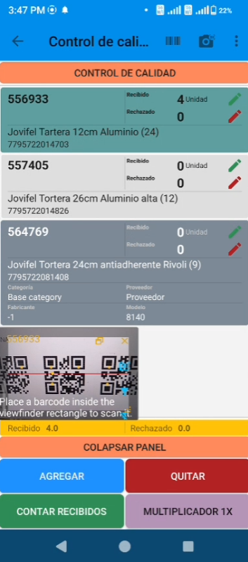

# Ventana Flotante de Escaneo de Códigos (Ejemplo)

Este es un ejemplo de implementación de una ventana flotante para escanear códigos de barras y QR en aplicaciones
Android, escrita en Kotlin. La ventana se puede mover, redimensionar y personalizar según las necesidades de la
aplicación.

## Características

- **Ventana flotante** que permanece visible sobre otras aplicaciones
- **Modo continuo y simple** de escaneo (configurable)
- **Soporte para múltiples formatos** de códigos (QR, PDF417, DataMatrix, etc.)
- **Personalización completa** de la interfaz y funcionalidades
- **Guardado de posición y tamaño** entre sesiones
- **Soporte para diferentes orientaciones** (vertical y horizontal)
- **Filtro de lecturas repetidas** (configurable)
- **Control de luz/flash** integrado



## Librerías externas utilizadas

- **EasyFloat**: Para implementar la ventana flotante con capacidades de arrastre y redimensionamiento
- **ZXing**: Biblioteca para procesamiento de códigos de barras

## Permisos requeridos

- **CAMERA**: Para acceder a la cámara del dispositivo
- **Permisos de ventana flotante**: Para mostrar la ventana sobre otras aplicaciones

## Configuración básica

Para utilizar este componente en tu aplicación:

1. Asegúrate de tener los permisos necesarios configurados
2. El componente se inicializa con la actividad anfitriona
3. Se pueden configurar los formatos de códigos a escanear a través de variables de configuración
4. Los parámetros de tamaño y posición se guardan automáticamente

## Uso

El uso es sencillo, basta con crear una instancia y llamar a los métodos correspondientes durante el ciclo de vida de la
actividad:

```kotlin
// Crear instancia
private val floatingScanner = FloatingCameraBarcode(this)

// Durante el ciclo de vida de la actividad
override fun onResume() {
    super.onResume()
    floatingScanner.onResume()
}

override fun onPause() {
    super.onPause()
    floatingScanner.onPause()
}

override fun onDestroy() {
    super.onDestroy()
    floatingScanner.onDestroy()
}

// Para mostrar/ocultar la ventana
floatingScanner.toggleWindowVisibility()
```

## Personalización

El componente permite personalizar:

- Los formatos de códigos a escanear (QR, PDF417, etc.)
- El modo de escaneo (continuo o simple)
- Si se filtran o no las lecturas repetidas
- Color de los iconos e interfaz
- Tamaño y posición predeterminados

Este es un ejemplo práctico que puedes adaptar y expandir según tus necesidades específicas de escaneo en tu aplicación
Android.